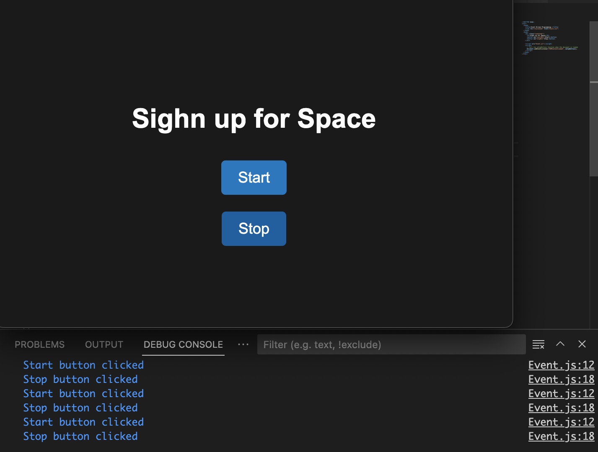

This project is a web page that features two buttons, Start and Stop, that are wired up to JavaScript events. When the Start button is clicked, it disables itself and enables the Stop button. When the Stop button is clicked, it disables itself and enables the Start button.

## Getting Started
To run this project, you'll need a web browser and a text editor. Follow these steps:
Download the project files to your computer.
Open the index.html file in a web browser.
Click the Start button to disable it and enable the Stop button.
Click the Stop button to disable it and enable the Start button.
The console will log a message indicating which button was clicked.

## Conclusion
This project demonstrates how to create buttons and wire them up to JavaScript events. It also shows how to apply event-driven programming and user acceptance testing. This project can be easily modified to add more functionality and improve the design.

## LICENSE
**Open to Experiment**

BY:ROBERT SMITH

CREDIT: University of Advancing Technology

EMAIL - Robertsdev8@gmail.com.com for Colloboration 